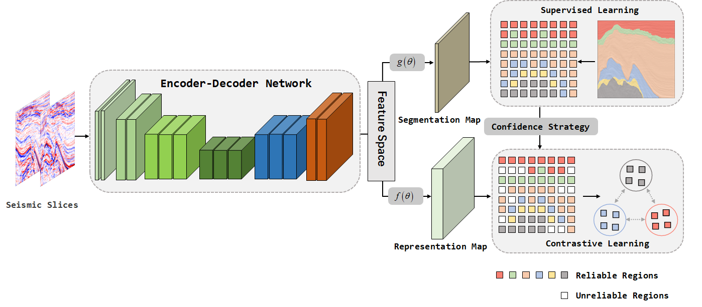
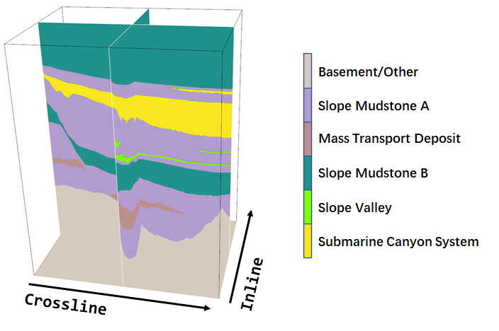
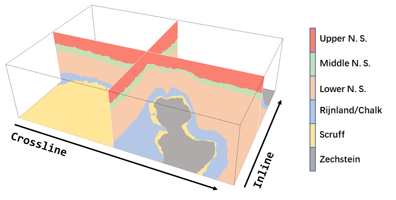
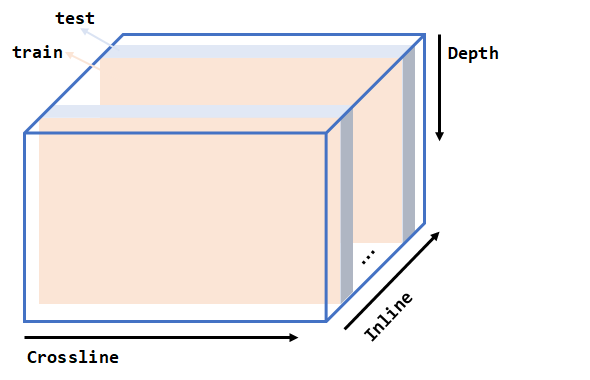

### Abstract

> Recently, convolutional neural networks (CNNs) have been widely applied in the seismic facies classification. However, even state-of-the-art CNN architectures often encounter classification confusion distinguishing seismic facies at their boundaries. Additionally, the annotation is a highly time-consuming task, especially when dealing with 3D seismic data volumes. While traditional semi-supervised methods reduce dependence on annotation, they are susceptible to interference from unreliable pseudo-labels. To address these challenges, we propose a semi-supervised seismic facies classification method called CONSS, which effectively mitigates classification confusion through contrastive learning. Our proposed method requires only 1% of labeled data, significantly reducing the demand for annotation. To minimize the influence of unreliable pseudo-labels, we also introduce a confidence strategy to select positive and negative sample pairs from reliable regions for contrastive learning. Experimental results on the publicly available seismic datasets, Netherlands F3 and SEAM AI challenge dataset, demonstrate that the proposed method outperforms classic semi-supervised methods, including self-training and consistency regularization, achieving exceptional classification performance.



### Installation

Runing the following scripts in turn for installation and training.

```
git clone https://github.com/upcliuwenlong/CONSS_SEISMIC_FACIES.git && cd CONSS_SEISMIC_FACIES
pip install -r requirements.txt

# Supervised learning
python train_sup.py

# Pseudo-label
python train_st.py

# Mean-teacher
python train_mt.py

# Cross pseudo supervision
python train_cps.py

# Cross-consistency training
python train_cct.py

# conss-single
python train_conss_single.py

# conss-dual
python train_conss.py

# inference
python predict_f3.py
python predict_seam.py

# evaluate
python evaluate_f3.py
python evaluate_seam.py
```

### Seismic Surveys

- SEAM AI challenge dataset
  
  The SEAM AI challenge dataset is a 3D seismic image from a public-domain seismic survey called Parihaka, available from the New Zealand government, has been interpreted by expert geologists.  
  
  - **Basement/Other**: Basement - Low S/N; Few internal Reflections; May contain volcanics in places.
  - **lope Mudstone A**: Slope to Basin Floor Mudstones; High Amplitude Upper and Lower Boundaries; Low Amplitude Continuous/Semi-Continuous Internal Reflectors.
  - **Mass Transport Deposit**: Mix of Chaotic Facies and Low Amplitude Parallel Reflections.
  - **Slope Mudstone B**: Slope to Basin Floor Mudstones and Sandstones; High Amplitude Parallel Reflectors; Low Continuity Scour Surfaces.
  - **Slope Valley**: High Amplitude Incised Channels/Valleys; Relatively low relief.
  - **Submarine Canyon System**: Erosional Base is U shaped with high local relief.
  
  [Download Link](https://drive.google.com/drive/folders/1hvWpCGta3mrWVl4Ct44RqLSmbEb_JA-n?usp=sharing)
  
  
  
- Netherlands F3 dataset
  
  F3 block is located in the north of the Netherlands. [Alaudah et al.](https://github.com/olivesgatech/facies_classification_benchmark) artificially interpreted seven groups of lithostratigraphic units with reference to well logging data, and merged Rijnland Group and Chalk Group into one.
  
  - **Upper North Sea Group**: claystones and sandstones from Miocene to Quaternary.
  - **Lower and Middle North Sea Groups**: sands, sandstones, and claystones from Paleocene to Miocene.
  - **Rijnland Group**: clay formations with sandstones of Upper Cretaceous.
  - **Chalk Group**: carbonates of Upper Cretaceous and Paleocene.
  - **Scruff Group**: claystones of Upper Jurassic and Lower Cretaceous.
  - **Zechstein Group**: evaporites and carbonates of Zechstein.
  
  [Download Link](https://drive.google.com/drive/folders/1SmrQ7BfpUFFMZugR3vo-tnfX69e_uLfo?usp=sharing)
  
  

### Label sampling

3D seismic volume is uniformly divided into different blocks. In each block, the first slices go to the training set and the adjacent rest to the test set.




### Experiment Results

- Netherlands F3 dataset
  
  | Method                     | PA        | MCA       | MIOU      | F1        | CHECKPOINTS                                                  |
  | -------------------------- | --------- | --------- | --------- | --------- | ------------------------------------------------------------ |
  | supervised                 | 96.62     | 92.09     | 87.12     | 92.87     | [Google Drive](https://drive.google.com/file/d/1c6wZlWxEAHvgqBHKsI902qeFRNckJtYm/view?usp=drive_link) |
  | Pseudo-label               | 97.04     | 92.43     | 87.83     | 93.31     | [Google Drive](https://drive.google.com/file/d/1TDq6J0olk6iMJsHEj88xef2a322uhefR/view?usp=drive_link) |
  | Mean-teacher               | 97.38     | 94.19     | 89.06     | 94.05     | [Google Drive](https://drive.google.com/file/d/167mb23JI3ruQ-KI8BjLYVBs5fa9SZQlc/view?usp=drive_link) |
  | Cross pseudo supervision   | 97.44     | 94.02     | 89.24     | 94.16     | [Google Drive](https://drive.google.com/file/d/1V9jnZAHt9oeCge13RCEgtq2GbwrdtbhM/view?usp=drive_link) |
  | Cross-consistency training | 97.48     | 94.58     | 89.78     | 94.49     | [Google Drive](https://drive.google.com/file/d/1FYsxXOfDTYZbn1FU_5ORyHw20umEMvsg/view?usp=drive_link) |
  | CONSS w/ single-level      | 97.52     | 95.28     | 90.01     | 94.62     | [Google Drive](https://drive.google.com/file/d/1F0Cn_ypUwTgA6fu4X069VFVvYCEzgN28/view?usp=drive_link) |
  | CONSS w/ dual-level        | **97.66** | **96.52** | **90.73** | **95.04** | [Google Drive](https://drive.google.com/file/d/1_u2VdtE1t-TbPvAJOV4f5kYmcJCXgKL4/view?usp=drive_link) |


- SEAM AI dataset
  
  | Method                     | PA        | MCA       | MIOU      | F1        | CHECKPOINTS                                                  |
  | -------------------------- | --------- | --------- | --------- | --------- | ------------------------------------------------------------ |
  | Supervised                 | 95.04     | 89.69     | 83.04     | 90.38     | [Google Drive](https://drive.google.com/file/d/12_s_RLQeTNeFrctNAw7Jwp-ha0Fh3WmE/view?usp=drive_link) |
  | Pseudo-label               | 95.57     | 91.27     | 85.01     | 91.44     | [Google Drive](https://drive.google.com/file/d/1s09FO1FUVTeS44Pw4QnMpKF4lBnuXUTB/view?usp=drive_link) |
  | Mean-teacher               | 95.74     | 91.61     | 85.38     | 91.67     | [Google Drive](https://drive.google.com/file/d/1iaH6B3JIqCRtDcW34Qt4b-GqKgO5KOG-/view?usp=drive_link) |
  | Cross pseudo supervision   | 96.55     | 90.62     | 86.54     | 92,28     | [Google Drive](https://drive.google.com/file/d/1jrD072nxmJ2T6vVKF1yHn9jqu14c9eqd/view?usp=drive_link) |
  | Cross-consistency training | 96.18     | 92.70     | 86.56     | 92.41     | [Google Drive](https://drive.google.com/file/d/10gspf17yPCkXfj_6HxHeQyqxyu8xm8Lw/view?usp=drive_link) |
  | CONSS w/ single-level      | 96.57     | 92.34     | 87.09     | 92.69     | [Google Drive](https://drive.google.com/file/d/1IWus19TwdY598DjIVyPmEE9JnX40cteS/view?usp=drive_link) |
  | CONSS w/ dual-level        | **96.67** | **93.08** | **87.99** | **93.30** | [Google Drive](https://drive.google.com/file/d/191Z2u60eM2VPqtodPnna7gp2SXiycJBl/view?usp=drive_link) |


### Contact

- Wenlong Liu, 1707020116@s.upc.edu.cn
- Yimin Dou,  emindou3015@gmail.com
